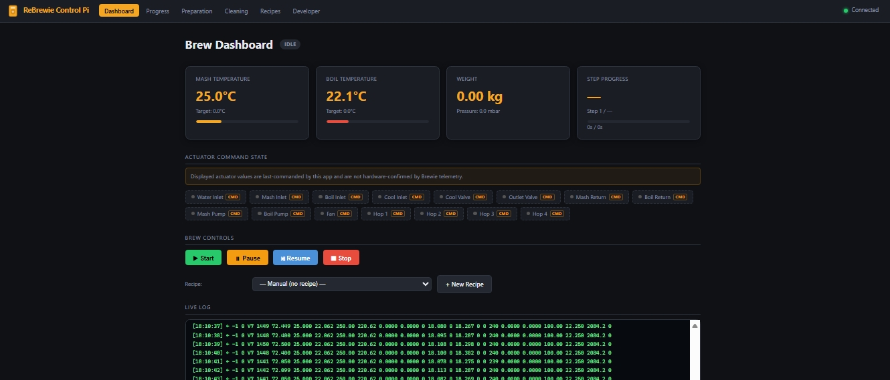
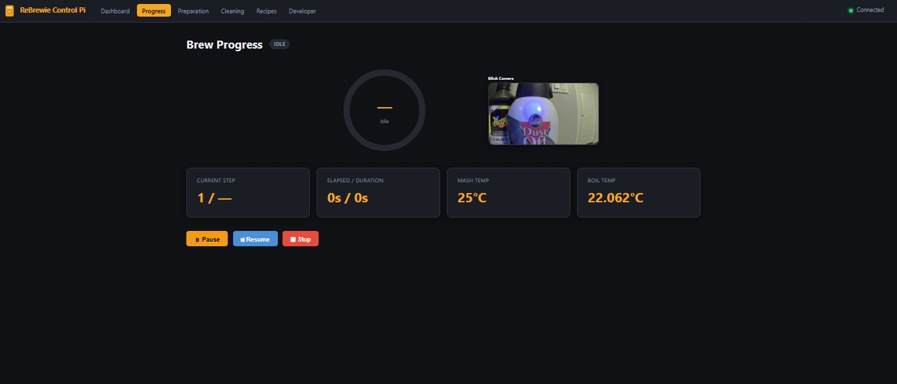
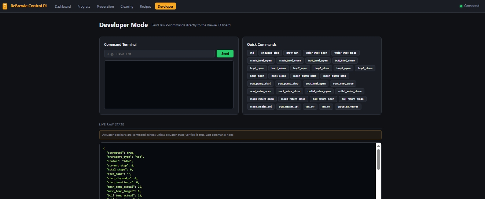

# ReBrewie-Pi-Control


[](LICENSE)
[](https://www.python.org/)
[](https://fastapi.tiangolo.com/)
[](https://www.raspberrypi.com/)

## Project Title

**ReBrewie-Pi-Control**

## Description

This is a Raspberry Pi-native (tested on a RPi Zero W with 512 MB of RAM) local-only web controller for Brewie+ / ReBrewie machines. It is a replacement for the original Brewie Control Android APK, but keeps the original app concepts - connect on the same Wi-Fi/LAN, monitor brew state, start/pause/resume/stop, manage recipes, and view live progress - while adding modern transport flexibility and a ReBrewie project mirroring "Developer" mode (to access the additional functionality provided by the ReBrewie project), which allows direct command injection.

The app runs a FastAPI web server on the Raspberry Pi and communicates with the Brewie machine over TCP, HTTP bridge, serial, or mock transport. The verified local setup uses the Pi web UI at `http://<pi-ip>:8080` and a Brewie TCP bridge at `<brewie-ip>:9000`.

> Experimental software: use at your own risk. Brewie machines include pumps, valves, heaters, and water paths. Always supervise physical operation.

## Features

- Local-only responsive web dashboard for Brewie/ReBrewie control.
- Live telemetry parsing for Brewie V7-style status frames.
- Manual preparation controls for water inlet, valves, pumps, heaters, fan, and stop commands.
- Brewing recipe list, editor, upload/import flow, and recipe start/pause/resume/stop controls.
- Stock Brewie JSON recipe importer that converts original `instructions` arrays into internal `P103` controller steps.
- Separate Cleaning Programs area for Short Clean, Full Clean, and Sanitizing Clean routines.
- Optional Blink camera snapshot panel on the Progress page with a 60-second refresh interval.
- Emergency stop path that sends valve/pump/heater shutdown commands.
- Developer Mode terminal for raw P-command testing.
- Stock Brewie TCP framing support (`$ packet length payload check *`) with ACK parsing.
- Discovery helpers and Brewie-side diagnostic tools for local troubleshooting.
- Raspberry Pi deployment scripts for Windows PowerShell and Linux/macOS shell users.

## Screenshots

The web interface is available from any browser on the same LAN at `http://<pi-ip>:8080` after installation.

### Dashboard



### Progress



### Preparation


### Cleaning


### Recipes


### Developer



## Tech Stack

- Python 3.11+ / Python 3.13 on Raspberry Pi OS
- FastAPI, Starlette, Uvicorn
- Pydantic and pydantic-settings
- Jinja2 templates
- Vanilla JavaScript and CSS
- pyserial and httpx
- blinkpy for optional Blink camera snapshots
- systemd service for Raspberry Pi deployment
- PowerShell and shell deployment scripts
- OpenAI Codex App, used during development, review, and documentation preparation

## Installation

### 1. Raspberry Pi prerequisites

Use Raspberry Pi OS or another Debian-like Linux image.

```bash
sudo apt update
sudo apt install -y python3 python3-venv python3-pip openssh-server rsync
```

Make sure the Pi and Brewie machine are on the same local network. DHCP reservations are recommended so their IP addresses do not change.

### 2. Brewie machine prerequisites

The verified setup expects a TCP bridge on the Brewie machine, usually listening on port `9000`. Helper tools are included in:

```text
contrib/brewie-machine/
```

Deploy from Windows:

```powershell
.\deploy-to-brewie.ps1 -Host 192.168.1.132 -User root -Password "your-password"
```

Then review `contrib/brewie-machine/README.md` for probe and bridge options.

### 3. Configure project settings

Copy `.env.example` to `.env` on the Pi and adjust device-specific values:

```bash
cp .env.example .env
nano .env
```

Important values:

```env
BREWIE_TRANSPORT=tcp
BREWIE_HOST=192.168.1.132
BREWIE_PORT=9000
BREWIE_TCP_FRAMING=true
LOCAL_BIND=0.0.0.0
LOCAL_PORT=8080
TO_LITER=20.0
```

Reminder: update the Raspberry Pi and Brewie IP addresses for your own network.

### 4. Install on the Raspberry Pi

From the project folder on the Pi:

```bash
./install.sh
sudo systemctl enable --now rebrewie-control-pi
```

Open:

```text
http://<pi-ip>:8080
```

## Usage

### Dashboard

View connection status, temperatures, actuator echoes, telemetry, and current program state.

### Preparation

Use manual controls for preparation and testing. These commands affect real hardware.

### Cleaning

Use the Cleaning page for maintenance programs:

- Short Clean
- Full Clean
- Sanitizing Clean

Each run requires confirmation. Emergency Stop remains available on the same page.

### Blink Camera

The Progress page can show an optional Blink camera snapshot beside the brew progress tracker. Blink does not provide a true local live video stream through `blinkpy`; this app requests a fresh cloud snapshot no faster than once every 60 seconds.

This integration was tested with a Blink Mini camera shown by Blink as `Mini - 0FSB`.

Set these values in `.env` when you want the panel enabled:

```env
BLINK_ENABLED=true
BLINK_USERNAME=your_blink_email@example.com
BLINK_PASSWORD=your_blink_password
BLINK_CAMERA_NAME=
BLINK_REFRESH_SECONDS=60
BLINK_AUTH_FILE=.blink-auth.json
```

Leave `BLINK_CAMERA_NAME` blank to use the first camera returned by Blink, or set it to the exact camera name shown in the Blink app.

Blink commonly requires one-time two-factor authentication before a headless Raspberry Pi service can request snapshots. The app stores the verified Blink session in `BLINK_AUTH_FILE` (default `.blink-auth.json`) inside `/opt/rebrewie-control-pi`. The deployment script preserves both `.env` and `.blink-auth.json`, so later app updates should not wipe the Blink login token.

Suggested Pi-side verification flow:

1. Configure the Blink variables in `/opt/rebrewie-control-pi/.env`.
2. Restart the service: `sudo systemctl restart rebrewie-control-pi`.
3. Open `/progress` or request `/api/blink/snapshot` once. Blink may send a verification code by text message or email.
4. Use a short one-time script on the Pi to submit that code through `blinkpy`, then save `.blink-auth.json`.
5. Restart the service again and check `/api/blink/status`.

The verification code can expire quickly. If multiple failed attempts are made, Blink may return `2fa_rate_limit_exceeded` or a message such as `Try again in 600 seconds`; wait for that timeout before requesting/submitting another code. If `.blink-auth.json` is empty or malformed after a failed attempt, delete it and re-run verification with a fresh code.

Useful checks on the Pi:

```bash
cd /opt/rebrewie-control-pi
sudo systemctl status rebrewie-control-pi
curl http://127.0.0.1:8080/api/blink/status
curl -o /tmp/blink.jpg http://127.0.0.1:8080/api/blink/snapshot
```

Expected successful status includes `"enabled":true`, `"configured":true`, `"auth_file_exists":true`, and `"last_error":null`.

If the dashboard still shows the raw full-size image, hard-refresh the browser so it loads the current CSS. The dashboard intentionally displays a resized snapshot; opening `/api/blink/snapshot` directly in its own browser tab will show the raw Blink image dimensions.

### Remote Access with Cloudflare Tunnel

For remote access outside the local network, the recommended proof-of-concept setup is Cloudflare Tunnel in front of the existing Pi web app. The verified test route used:

```text
https://rebrewie-pi.commogrunt.com -> http://192.168.1.113:8080
```

When the tunnel connector runs on a Windows desktop or another LAN device, the public hostname service URL must point to the Pi's LAN address (`192.168.1.113:8080`). Use `localhost:8080` only if `cloudflared` is running on the same Raspberry Pi as this app.

Before exposing the app through any public hostname, enable app login in `.env`:

```env
AUTH_ENABLED=true
AUTH_ALLOW_INITIAL_REGISTRATION=true
REMOTE_PUBLIC_HOSTNAME=rebrewie-pi.commogrunt.com
MACHINE_ID=HN0251807090304
```

On first visit, the app redirects to `/register` when no owner account exists yet. That registration screen creates the owner username/password and binds the account to the Brewie machine ID/serial number. The registration is stored locally in `owner-registration.json`, which should stay private and should not be committed to GitHub.

For unattended installs, you can still pre-seed the owner login with environment variables instead of using `/register`:

```env
AUTH_USERNAME=your-user-name
AUTH_PASSWORD_HASH=pbkdf2_sha256$...
AUTH_SESSION_SECRET=long-random-secret
```

Generate the optional pre-seeded password hash and session secret from the project directory:

```bash
python -c "from app.auth import hash_password; print(hash_password('your-password'))"
python -c "import secrets; print(secrets.token_urlsafe(32))"
```

The login cookie is HTTP-only and signed. Keep `.env`, `owner-registration.json`, Cloudflare Tunnel tokens, Blink passwords, and Blink auth tokens private. The Settings page shows the registered owner and machine, and lets you update the machine label or serial number without editing files manually.

### Recipes

Upload ReBrewie-format JSON or original stock Brewie JSON recipes. Stock recipe JSON files are converted into internal controller steps and saved into `recipes/`.

### Developer

Send raw P-commands directly to the controller. This mode is intended for careful troubleshooting and protocol development.

## API Reference

| Method | Endpoint | Description |
| --- | --- | --- |
| GET | `/api/status` | Current application and telemetry state |
| GET | `/api/blink/status` | Blink camera configuration/cache status |
| GET | `/api/blink/snapshot` | Cached Blink camera JPEG snapshot |
| GET | `/api/log?n=100` | Recent in-memory event log |
| POST | `/api/command` | Send a raw command, JSON body `{ "cmd": "P999" }` |
| POST | `/api/control/start` | Start a brew recipe, body `{ "recipe_id": "..." }` |
| POST | `/api/control/pause` | Pause by closing all valves |
| POST | `/api/control/resume` | Re-initialize and resume/requeue current step |
| POST | `/api/control/stop` | Stop program and send shutdown commands |
| POST | `/api/control/step` | Manually enqueue a recipe step |
| POST | `/api/developer/raw` | Send raw developer P-command |
| GET | `/api/developer/commands` | List configured command map |
| GET | `/api/recipes` | List recipes |
| POST | `/api/recipes` | Create recipe |
| GET | `/api/recipes/{recipe_id}` | Fetch recipe |
| PUT | `/api/recipes/{recipe_id}` | Update recipe |
| DELETE | `/api/recipes/{recipe_id}` | Delete recipe |
| POST | `/api/recipes/upload` | Upload `.json` recipe and convert if needed |
| GET | `/api/cleaning` | List cleaning programs |
| POST | `/api/cleaning/upload` | Upload `.json` cleaning program |
| POST | `/api/cleaning/{program_id}/start` | Start a cleaning program |
| GET | `/api/device/scan` | Scan/discover likely Brewie devices |
| POST | `/api/device/configure` | Configure discovered device transport |
| WebSocket | `/ws` | Live state updates |

## Configuration

Configuration is handled by environment variables, usually through `.env`.

| Variable | Default | Purpose |
| --- | --- | --- |
| `BREWIE_TRANSPORT` | `tcp` | `tcp`, `http`, `serial`, or `mock` |
| `BREWIE_HOST` | `192.168.1.132` | Brewie machine IP |
| `BREWIE_PORT` | `9000` | Brewie TCP bridge port |
| `BREWIE_TCP_FRAMING` | `true` | Enable stock Brewie frame wrapping |
| `BREWIE_HTTP_BASE` | `http://192.168.1.113:8080` | HTTP bridge base URL |
| `BREWIE_SERIAL_PORT` | `/dev/ttyUSB0` | Serial device path |
| `BREWIE_SERIAL_BAUD` | `115200` | Serial baud rate |
| `LOCAL_BIND` | `0.0.0.0` | Web bind address |
| `LOCAL_PORT` | `8080` | Web port |
| `AUTH_ENABLED` | `false` | Require app login for pages, API routes, and WebSocket |
| `AUTH_USERNAME` | `admin` | App login username |
| `AUTH_PASSWORD_HASH` | empty | PBKDF2 password hash generated by `app.auth.hash_password` |
| `AUTH_SESSION_SECRET` | empty | Secret used to sign login cookies |
| `AUTH_SESSION_HOURS` | `12` | Login session duration |
| `AUTH_COOKIE_SECURE` | `false` | Set `true` for HTTPS-only remote access |
| `AUTH_ALLOW_INITIAL_REGISTRATION` | `true` | Allow `/register` to create the first owner account when no login exists |
| `AUTH_REGISTRATION_FILE` | `owner-registration.json` | Private owner account and machine binding file |
| `REMOTE_PUBLIC_HOSTNAME` | empty | Hostname that should show the remote connection indicator |
| `MACHINE_ID` | `HN0251807090304` | Default registered Brewie machine ID/serial |
| `MACHINE_REGISTRY_FILE` | `machine-registration.json` | Writable machine registration file |
| `BLINK_ENABLED` | `false` | Enable the optional Progress page camera panel |
| `BLINK_USERNAME` | empty | Blink account username/email |
| `BLINK_PASSWORD` | empty | Blink account password |
| `BLINK_CAMERA_NAME` | empty | Optional exact Blink camera name; first camera is used when blank |
| `BLINK_REFRESH_SECONDS` | `60` | Snapshot refresh interval; values below 60 are clamped to 60 |
| `BLINK_AUTH_FILE` | `.blink-auth.json` | Saved blinkpy auth token file after 2FA verification |
| `RECIPE_DIR` | `recipes` | Recipe storage folder |
| `DISCOVERY_ENABLED` | `true` | Enable discovery helpers |
| `TO_LITER` | `20.0` | Default batch/session volume |
| `MASH_TEMP_DELTA` | `0.0` | P80 mash calibration delta |
| `BOIL_TEMP_DELTA` | `0.0` | P80 boil calibration delta |

## Tests

Basic validation:

```bash
python3 -m py_compile app/config.py app/main.py app/recipes.py app/routers/api.py
bash scripts/verify_app_import.sh
```

TCP bridge checks:

```bash
python3 scripts/test_brewie_tcp_bridge.py --host <brewie-ip> --port 9000
```

Pi telemetry check:

```bash
python3 scripts/check_pi_telemetry.py --url http://<pi-ip>:8080
```

## Deployment

### Windows to Raspberry Pi

```powershell
.\deploy-to-pi.ps1 -HostName 192.168.1.113 -User pi -Password "your-password"
```

### Linux/macOS to Raspberry Pi

```bash
PI_HOST=192.168.1.113 PI_USER=pi APP_DIR=/opt/rebrewie-control-pi scripts/deploy_to_pi.sh
```

### Brewie helper tools

```powershell
.\deploy-to-brewie.ps1 -Host 192.168.1.132 -User root -Password "your-password"
```

## Run Locally

Mock mode is useful for web UI development without a Brewie machine:

```bash
python3 -m venv .venv
. .venv/bin/activate
pip install -r requirements.txt
BREWIE_TRANSPORT=mock uvicorn app.main:app --host 127.0.0.1 --port 8080
```

Open `http://127.0.0.1:8080`.

## Code Example

Build the P80 initialization command:

```python
from app.config import settings

cmd = settings.build_p80_command(volume_l=20.0)
print(cmd)  # P80 20.0 0 0.00000 0.00000
```

Convert a recipe step to a `P103` command:

```python
from app.recipes import load_recipe

recipe = load_recipe("demo-ipa1")
args = recipe.to_p103_args(0)
print("P103", args)
```

Send a raw command through the API:

```bash
curl -X POST http://<pi-ip>:8080/api/command \
  -H "Content-Type: application/json" \
  -d '{"cmd":"P999"}'
```

## Code Structure

- `app/main.py` starts FastAPI, the transport, and receive loop.
- `app/config.py` loads settings and defines canonical command strings.
- `app/transports/` contains TCP, HTTP, serial, and mock transports.
- `app/parser.py` parses Brewie telemetry into shared state.
- `app/state.py` stores live state and command echoes.
- `app/recipes.py` models recipes, import conversion, and cleaning programs.
- `app/routers/` exposes REST, WebSocket, page, and discovery routes.
- `app/templates/` and `app/static/` implement the web interface.
- `contrib/brewie-machine/` contains Brewie-side helper tooling.

## File Structure

```text
ReBrewie-Control-Pi/
  app/
    routers/
    static/
    templates/
    transports/
  assets/
  cleaning_programs/
  contrib/brewie-machine/
  docs/
  recipes/
  scripts/
  systemd/
  .env.example
  install.sh
  deploy-to-pi.ps1
  deploy-to-brewie.ps1
  README.md
  requirements.txt
```

## Documentation

Class-level documentation is available in `docs/`, including:

- `docs/Settings.md`
- `docs/Recipe.md`
- `docs/RecipeStep.md`
- `docs/BrewState.md`
- `docs/TcpTransport.md`
- `docs/BaseTransport.md`
- `docs/BrewieDiscovery.md`

Brewie machine helper documentation is in `contrib/brewie-machine/README.md`.

## Contributing

Contributions are welcome. Recommended workflow:

1. Fork the repository.
2. Create a feature branch.
3. Keep changes focused and documented.
4. Test with mock transport where possible.
5. For hardware changes, document the machine, network, and command sequence used.
6. Open a pull request with clear safety notes.

## Contributors

| Contributor | Role |
| --- | --- |
| CommoGrunt | Original author and project maintainer |

## FAQ

### Is this official Brewie software?

No. This is an experimental community project.

### Does it require internet access?

No. The web controller is designed for local network use.

### Can I use DHCP?

Yes, but DHCP reservations are recommended for the Raspberry Pi, Brewie machine, and development computer.

### Do I need both `.json` and `.brewie` recipe files?

No. This app imports JSON recipe files. Original `.brewie` files are compressed Qt Binary JSON packages and are not required for this importer.

### Why does the UI say actuator state is commanded?

Some Brewie telemetry echoes the last command rather than confirming every actuator electrically. The UI labels this distinction where possible.

## Roadmap

Future additions and updates may include features to facilitate webhosting to allow secure remote access outside of a local network, monitoring and controlling multiple machines registered via their unique machine ID/Serial #, and the addition of a webcam feed option to the Progress screen to allow live remote observation to better detect issues such as a boil over situation which may not set off any error messages.

## Security

- This app is designed for trusted local networks only.
- Do not expose it directly to the public internet.
- Developer Mode allows direct command injection and can actuate real hardware.
- Change default passwords on Raspberry Pi and Brewie SSH accounts.
- Use DHCP reservations or static addressing only on trusted LANs.
- Review uploaded recipes before brewing.

## Support

This is experimental software, please use at your own risk as no support is currently available other than the information already provided.

## Acknowledgements

I have no programming experience and have taken this project on to learn as I go, so please forgive all of my coding errors. Original source code files and examples borrowed from the Brewie+ stock software, ReBrewie project improvements, Facebook Brewie Owners Group, https://think.gusius.com/, and multiple others that deserve all the credit for compiling and updating the original code to improve and keep our Brewie machines going.

Blink camera integration references the community [`fronzbot/blinkpy`](https://github.com/fronzbot/blinkpy) project.

## Acknowledgement Codes

The original manufacturer Android APK file was inspected to understand the original app layout and styling.

## References

- Original Brewie+ software and Android App APK
- ReBrewie project source code files
- Brewie Owners community knowledge and troubleshooting notes
- [`fronzbot/blinkpy`](https://github.com/fronzbot/blinkpy), used for Blink camera account/session and snapshot behavior

## Related Projects

Related information and developments you might find interesting can be found by visiting the Facebook Brewie Owners Group.

## Changelog

### 0.2.0 - Current public release

- Added optional Blink camera snapshot panel on the Progress page.
- Added Blink 2FA token-file support and troubleshooting documentation.
- Added stock Brewie TCP frame encoding and ACK parsing.
- Added recipe JSON upload and conversion.
- Added Cleaning Programs page and separate cleaning program storage.
- Added improved stop behavior and actuator echo labeling.
- Added Brewie helper tools and deployment scripts.
- Added class-level documentation.

### 0.1.0 - Initial prototype

- FastAPI web UI with dashboard, preparation controls, progress, recipes, and developer terminal.
- Initial TCP, HTTP, serial, and mock transports.

## License

MIT License. See [LICENSE](LICENSE).

## Contact

No contact information is provided. The author is unable to provide direct support.
